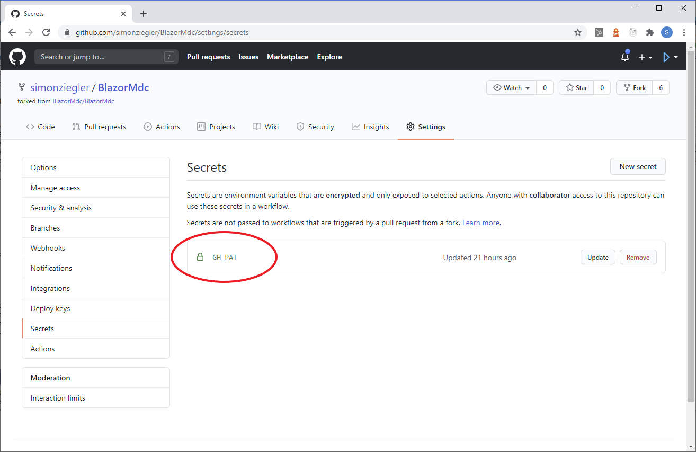

# Creating a Development Environment

We have developed Material.Blazor using Visual Studio 2019 on Windows, and have not tested any other development environment. However, the CI builds run on Ubuntu so for routine development a Linux environment should be quite acceptable.

## Forking the repos

- The full development environmment is in the Material.Blazor GitHub repository that you can fork from https://github.com/Material-Blazor/Material.Blazor. If you intend to submit pull requests please note that we use a`main` branch and accept feature branches created from `main`.
- The repo has Github Actions for `main`. In your forked repo, [`GithubActionsMainWIP`](https://github.com/Material-Blazor/Material.Blazor/blob/develop/.github/workflows/GithubActionsMainWIP.yml) will attempt to publish the documentation and this website to your GitHub pages:
  - If you want this to publish to `<repository owner>/github.io/Material.Blazor`, you will need to set up a Personal Access Token with write access to your repos - PATS are set up by clicking your icon at the top right on GitHub, then Settings and Developer Settings in the navigation menu to the left.
  </img>
  </img>
  </img>
  - Next go to the Settings of your forked repo and add a secret called "GH_PAT" using the contents of the PAT that you created in the previous step.
  </img>
  - Now go to the main settings for your forked repo and scroll down until the "GitHub Pages" section. Select the "gh-pages branch" as the Source.
  </img>
  - The docs should now publish next time you push to your `develop` branch on GitHub.

## Configuring the development environment

- To build the Blazor project you need to be using the latest preview version of Visual Studio 2019. This can be found at [https://visualstudio.microsoft.com/vs/preview/](https://visualstudio.microsoft.com/vs/preview/). The Community Edition is sufficient. During the installation you must include the "ASP.NET and web development" Workload using Visual Studio Installer.:
  </img>
- Material.Blazor uses SASS for styling and uses Material Components Web SASS mixins, and additionally TypeScript with the Material Components Web's TypeScript. This is the reason you need to select "Node.js development" in the previous step.
- Unless you have a separate installation of NodeJs on your computer, you may need to add the directory path to npm.cmd to the OS environment variable PATH. Typically this would be "C:\Program Files (x86)\Microsoft Visual Studio\2019\Preview\MSBuild\Microsoft\VisualStudio\NodeJs", but depends on the Visual Studio edition and version you're actually using. Make sure to restart Visual Studio after modifying the PATH variable.
- If you have a separate NodeJs installation be certain that you have npm 8.1.2 or higher and node 17.1.0 or higher.
 
- There are some Visual Studio extensions that you need or may want:
  - We like Markdown Editor, which will help you improve this page.
    </img>

