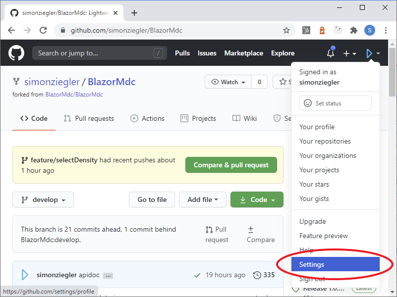
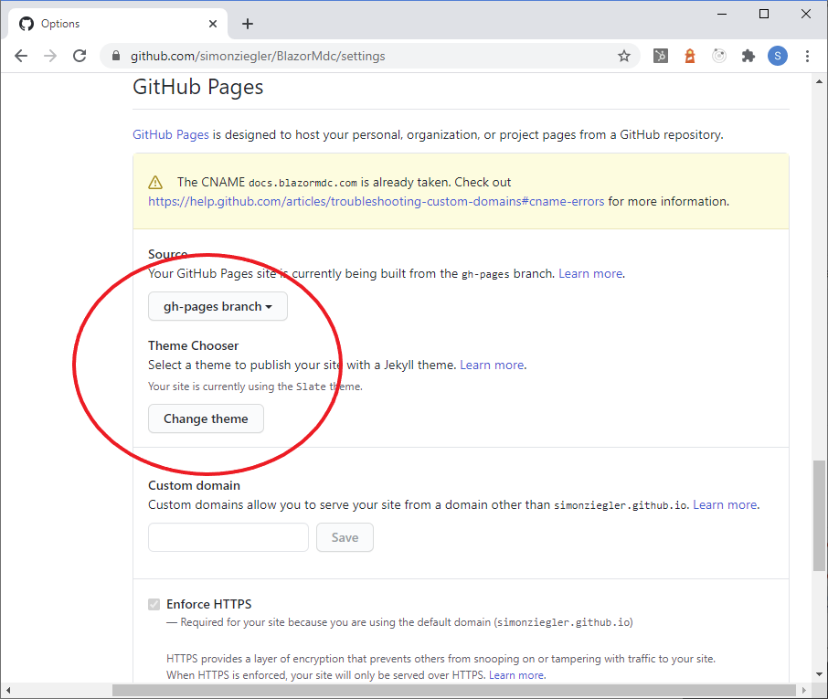
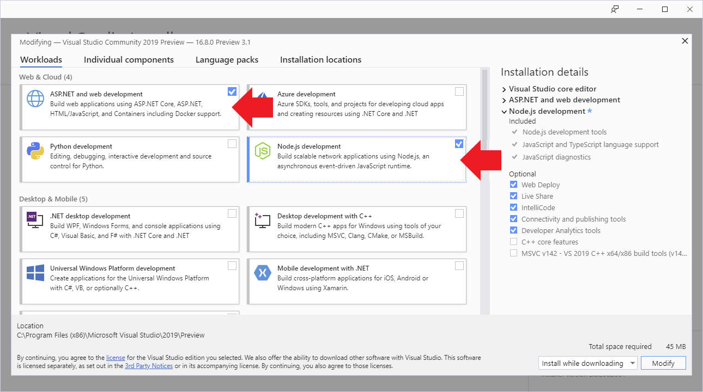
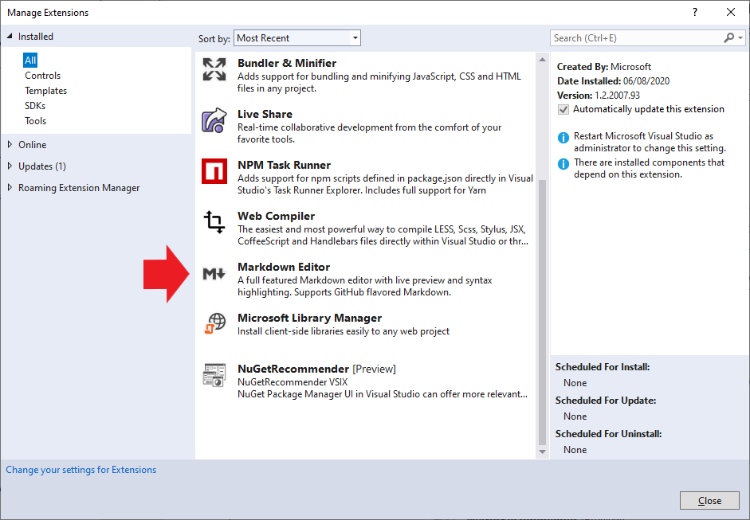

# Creating a Development Environment

We have developed Material.Blazor using Visual Studio 2019 on Windows, and have not tested any other development environment. However, the CI builds run on Ubuntu so for routine development a Linux environment should be quite acceptable.

## Forking the repos

- The full development environmment is in the Material.Blazor GitHub repository that you can fork from https://github.com/Material-Blazor/Material.Blazor. If you intend to submit pull requests please note that we use a`main` branch and accept feature branches created from `main`.
- The repo has Github Actions for `main`. In your forked repo, [`GithubActionsMainWIP`](https://github.com/Material-Blazor/Material.Blazor/blob/develop/.github/workflows/GithubActionsMainWIP.yml) will attempt to publish the documentation and this website to your GitHub pages:
  - If you want this to publish to `<repository owner>/github.io/Material.Blazor`, you will need to set up a Personal Access Token with write access to your repos - PATS are set up by clicking your icon at the top right on GitHub, then Settings and Developer Settings in the navigation menu to the left.
  </img>
  </img>
  </img>
  - Next go to the Settings of your forked repo and add a secret called "GH_PAT" using the contents of the PAT that you created in the previous step.
  </img>
  - Now go to the main settings for your forked repo and scroll down until the "GitHub Pages" section. Select the "gh-pages branch" as the Source.
  </img>
  - The docs should now publish next time you push to your `develop` branch on GitHub.

## Configuring the development environment

- To build the Blazor project you need to be using the latest preview version of Visual Studio 2019. This can be found at [https://visualstudio.microsoft.com/vs/preview/](https://visualstudio.microsoft.com/vs/preview/). The Community Edition is sufficient. During the installation you must include the "ASP.NET and web development" Workload using Visual Studio Installer.:
  </img>
- Material.Blazor uses SASS for styling and uses Material Components Web SASS mixins, and additionally TypeScript with the Material Components Web's TypeScript. This is the reason you need to select "Node.js development" in the previous step.
- Unless you have a separate installation of NodeJs on your computer, you may need to add the directory path to npm.cmd to the OS environment variable PATH. Typically this would be "C:\Program Files (x86)\Microsoft Visual Studio\2019\Preview\MSBuild\Microsoft\VisualStudio\NodeJs", but depends on the Visual Studio edition and version you're actually using. Make sure to restart Visual Studio after modifying the PATH variable.
- There are some Visual Studio extensions that you need or may want:
  - We like Markdown Editor, which will help you improve this page.
    </img>

## CI and Release GitHub Action workflows

These workflows are responsible for publishing three artifacts:
* The Material.Blazor DocFx pages in the Material.Blazor project
* Material.Blazor.WebAssembly published output 
* The Material.Blazor NuGet package 

The first two artifacts are combined and published in the repository gh-pages.

The third artifact is hosted as a GitHub package (CI) or a NuGet package (Release).

### WIP Workflow

This workflow runs whenever a pull request is created, updated, or pushed.

#### Forked repository

Regardless of the trigger, all three artifacts are published. The DocFx pages reside locally in the forked repository, the NuGet package is identified as a CI build & published to NuGet packages in the forked repository, and the Website is published into the gh-pages branch of a Material.Blazor.Website repository with the same owner as the forked Material.Blazor repository.

NOTE -- An issue exists when publishing the CI package to a forked repository in that the publish appears to work but the packages are not visible. For this reason (pending a service request response) the publish of the CI package is temporarily disabled.

#### Material-Blazor\Material.Blazor repository

Regardless of the trigger, the WebSite & DocFx pages are not built. On a Push trigger the the Material.Blazor Nuget package identified as a CI build is built and then published to the Material.Blazor repository . It is up to a developer to have checked the publishing results of the documentation and website in the forked repository prior to initiating a release workflow.

### Release Workflow

#### Forked repository

Upon creation of a tag no actions are performed in the multiple jobs. At the current time we see no reason to create releases in the forked repositories.

#### Material-Blazor\Material.Blazor repository

All three artifacts are produced. The documentation is in the Material-Blazor\Material.Blazor\gh-pages branch.
The Material.Blazor NuGet package is published to NuGet.org. The Website is in the Material.Blazor\Material.Blazor.Website\gh-pages branch.
