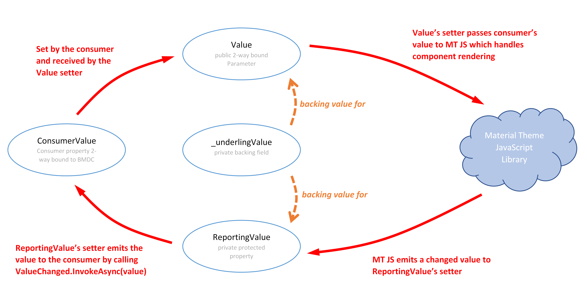

# Material.Blazor's Two Way Binding Approach

Material.Blazor takes an unusual approach to two way binding and rendering. Most components return `ShouldRender() => false;`. This is
to resolve an inherent conflict between how Blazor re-renders components when bound parameters are updated by their consumers and
how a JavaScript framework such as [Material Components Web ("MCW")](https://github.com/material-components/material-components-web) works.

In a pure Blazor world, Blazor takes care of rendering and re-rendering for you. In doing so it overwrites the relevant part of the
DOM. In a pure Material Theme world on the other hand, you mark your page up once and then call some instantiation JavaScript on your
material web components, from which point Material Components Web manipulates the DOM with user interaction. Let's consider an empty text field.

This article explains how Blazor's natural rendering mechanism and MCW are in contention and what we do to manage
this gracefully.

## How MCW Manipulates the DOM

Consider an empty outlined text field before and after a user gives it focus as below. Note how the label floats up and how both it and
the border gain color:

</img>

The text field's markup however has three distinct state. First what any app environment (including your app using Material.Blazor) marks
up in a page, then what this becomes once the text field has been initiated and manipulated by MCW and lastly 
how its state after receiving focus. The transition between the last two is animated by MCW.

1. Uninitiated markup
    ```html
    <label class="mdc-text-field mdc-text-field--outlined" >
        <input id="my-text-field" class="mdc-text-field__input" type="text" aria-label="Outlined Style">
        <span class="mdc-notched-outline">
            <span class="mdc-notched-outline__leading"></span>
            <span class="mdc-notched-outline__notch">
                <span class="mdc-floating-label " for="my-text-field">Outlined Style</span>
            </span>
            <span class="mdc-notched-outline__trailing"></span>
        </span>
    </label>
    ```
2. Markup post initiation - *all changes made by MCW*
    ```html
    <label class="mdc-text-field mdc-text-field--outlined">
        <input id="my-text-field" class="mdc-text-field__input" type="text" aria-label="Outlined Style">
        <span class="mdc-notched-outline mdc-notched-outline--upgraded">
            <span class="mdc-notched-outline__leading"></span>
            <span class="mdc-notched-outline__notch">
                <span class="mdc-floating-label " for="my-text-field" style>Outlined Style</span>
            </span>
            <span class="mdc-notched-outline__trailing"></span>
        </span>
    </label>
    ```
3. Markup with focus - *all changes made by MCW*
    ```html
    <label class="mdc-text-field mdc-text-field--outlined mdc-text-field--focused mdc-text-field--label-floating">
        <input id="my-text-field" class="mdc-text-field__input" type="text" aria-label="Outlined Style">
        <span class="mdc-notched-outline mdc-notched-outline--upgraded mdc-notched-outline--notched">
            <span class="mdc-notched-outline__leading"></span>
            <span class="mdc-notched-outline__notch">
                <span class="mdc-floating-label mdc-floating-label--float-above" for="my-text-field" style="width: 87.5px;">Outlined Style</span>
            </span>
            <span class="mdc-notched-outline__trailing"></span>
        </span>
    </label>
    ```

What we see from this is that if Material.Blazor were to allow Blazor to re-render, this would be with markup similar to 1. above and
MCW will then fail to manipulate the DOM correctly thereafter - we know this because we tried.

## Other Blazor Issues

Another factor we faced is that Blazor can perform a "bounce" when passing values into a component. This can be observed when using Cascading
Values; [see this GitHub issue](https://github.com/dotnet/aspnetcore/issues/24599#issuecomment-697588562) explaining the problem and receiving a detailed response from Steve Sanderson.
Coupling this with the need to prevent Blazor rendering brought us to the two way binding pattern that we use.

## How We Do Two Way Binding

When we first identified this issue during Material.Blazor's development we realized that our Blazor code needed to first render a
new component and then immediately after instantiating it step out of MCW's way by applying `ShouldRender() => false;` 
in `InputComponentFoundation`. If we did no more, two way binding would be broken because subsequent attempts by the consumer (your project) 
to update Value are ignored, which is an unacceptable result. Fortunately each MCW component has a rich 
JavaScript library that includes both the ability to set a value in the future and to be notified of that value being changed by 
the user. We make use of this in our two way binding for the `Value` parameter, and do something similar for the `Disabled` 
parameter.

The principle is like this:

</img>

Each component inheriting from `InputComponentFoundation` implements this mechanism separately calling the JavaScript provided
by MCW for that component:

- Overrides `SetComponentValue` from `InputComponentFoundation` to call the relevant MCW code via JSInterop;
- Registers a JSInterop callback with MCW for notification of value changes;
- Overrides `OnDisabledSet` from `ComponentFoundation` for to either call MCW via JSInterop to set the disabled state or to do so directly via Blazor binding as relevant; and
- *Does not* bind Value to any elements in the razor markup.

Without this careful mechanism Blazor and MCW can enter an infinite positive feedback loop of values bouncing from current to previous value.

## Debouncing

One last thing. In the [GitHub issue](https://github.com/dotnet/aspnetcore/issues/24599#issuecomment-697588562) that we mentioned above, `Value`
can bounce. We handle this by over-riding `OnParametersSet()` and `OnParametersSetAsync()` and checking for changes against cached versions of both
`Value` and `ComponentValue`. Material.Blazor only propagate changes to `Value` when it is indicative of a genuine consumer two-way binding 
data update:

- First there are cached versions of both `Value` and `ComponentValue`.
- In `OnParametersSet()`, if `Value` differs to `_cachedValue` we know that there is a genuine change of value (i.e. not a Cascading Value derived bounce).
  - If there is no change Material.Blazor does nothing more in `OnParametersSet()`.
  - If there is a change, `_cachedValue` is update and we move to the next test.
- Next we test `Value` against `ComponentValue`:
  - If they are the same, then we know that the component has been called in response to `ComponentValue` having emitted a `ValueChanged` event and we exit `OnParametersSet()`.
  - If they differ, we now know that this is a genuine new value. Material.Blazor sets `_cachedComponentValue` to `Value` and calls the component's value setter via JSInterop.

When the user interacts with the app changing a component's value, this is emitted via JSInterop to set `ComponentValue`

- First this new value is compared by the setter for `ComponentValue` to `_cachedComponentValue` further action is only taken if they differ.
- Next `_cachedComponentValue` is updated accordingly.
- Last the consumer code is notified of value changes by calling `ValueChanged()`.
- Note that Material.Blazor never sets `Value` in response to user/component interaction - this is the pattern set out by Steve Sanderson.