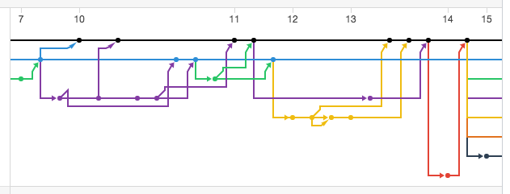
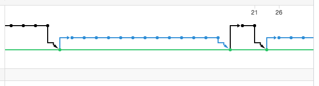
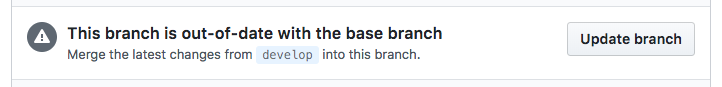
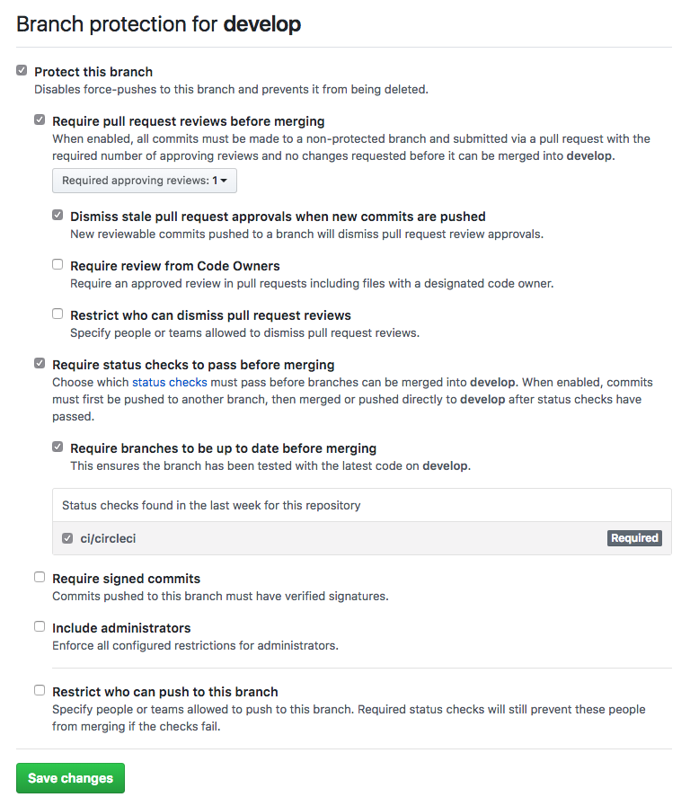
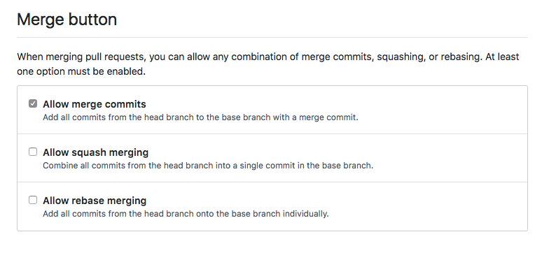

# Material.Blazor Project Guidelines

We do not want our repository to look like this:



but instead to have a flow that continues to look like this:



Note: Those are actual screenshots of real life commercial projects before and after introducing the following rules.

# Introduction

This documment explains how the Material.Blazor project is set up and developed
using Git in general and GitHub in particular.
It consists of rules that proved to work well over the years in
multiple commercial and open-source projects,
both small and large-scale.

It is intentionally written in the RFC-style language,
not necesserily because the author believes that no good git flow
is possible without strictly following these specific rules,
but because such guidelines are just like code style guides,
i.e. it's important to keep the entire project consistent
and for that goal a rule that you must use semicolons
or a rule that you must not use semicolons is always
better than a rule that you may use semicolons sometimes if you want.
For definitions of key words used to indicate requirement levels,
please refer to RFC 2119.

# Language

All comments, issues, pull requests titles and descriptions, code review comments,
commit messages, code comments, license, readme and all documentation
MUST be written in one language and that
language is English.

# License & Readme

The project contain as LICENSE.md file with an appropriate license for open-source projects or a text "Copyright (C) {YEAR} {ORGANISATION NAME}. All rights reserved."

The license is referenced in the project metadata.

The project includes a README.md file in the Markdown format.

The README file MUST be kept up to date.
(It is better to have incomplete information than incorrect
or outdated information in the README.)


# TBD - Beginning of text to be rewritten...

# Tests
The project MUST have a CI environment configured.

The project MUST include tests that are run automatically by CI
for every commit including pull requests **before** merging.

If the CI system provides a graphical badge indicating a CI status,
this badge MUST be included at the top of the README file.

# Style

The style guide described in the StylingGuidelines.md file MUST be enforced
by a linter that is run automatically by the CI.
It MUST be impossible to merge code that violates the chosen style guide.

The linter configuration MUST include indentation rules
(tabs vs. spaces) and line endings (Unix vs. Windows).

# Dependencies

All dependencies required by the project MUST be referenced in the project metadata.

Dependencies MUST be installed by the default method used for
installing dependencies for a given language and runtime
on a fresh checkout and a clean system.

The project MUST NOT depend on implicit dependencies and globally installed packages.

# Branches

The main development branch MUST be called `main` in the main repo for the project.

Changes MUST NOT be committed directly to the `main` branch by anyone.

Every contributor to the project MUST create a private fork of the repo.

All work MUST be done on feature branches, one for each new feature or bug fix.

All feature branches SHOULD be created on the developer private fork.
(This is to avoid repository polution and branch name conflicts.)

(If there is a good reason for that then optionally feature branches MAY be created on the original repo, but that SHOULD be avoided if possible. This is called a **"nonforking variant"** and the reason to use it should be clearly stated in the project's readme to avoid confusion among contributors.)

Every feature branch MUST be branched from the up-to-date `main` branch and it SHOULD be regularily rebased if there are any changes on `main` before it gets merged.
(This is to avoid more complicated merge conflicts when the PR is stale for too long.)

Feature and fix branches SHOULD be named using a convention:

* fix/broken-link
* feature/password-validation

Feature branches MAY be named using convention:

* broken-link
* password-validation

Feature branches MUST NOT be named in a way that requires additional knowledge to understand what they do.

Examples of bad branch names:

* fix/1234
* feature/meeting-nov-11
* task-12

# Commits

A commit message MUST have an informative subject in its first line.

A commit subject MUST NOT exceed 72 characters.

A commit subject MUST be in the form of:

- Do something

for example:

- Add password length validation

Commit subject MUST be capitalized and MUST NOT end with a period.

A correct subject line will always make sense in this sentence:

- "If applied, this commit will {THE SUBJECT LINE}."

For example:

- "If applied, this commit will fix broken link."
- "If applied, this commit will add password length validation."

A commit message MAY have a body with additional information.

The body if present MUST be separated from the subject by one blank line.

The body SHOULD NOT have any lines that exceed 72 characters
(it MAY have longer lines only if it is impossible to format otherwise,
e.g. with long URLs).

The body MAY include links and references to issues, pull requests,
other commits or more, if that is relevant only to this one commit.
If that information relates to the entire pull request then
that info SHOULD be present in the pull request description instead,
and it should get commited as a commit message of the merge commit
after the pull request gets merged.

GitHub pull requests and issues in commit bodies or pull request descriptions
MUST be referenced by #{NUMBER} and not a URL, e.g.:

- #1234

Other commits MUST be referenced by the commit hash (possibly abbreviated) and not a URL, e.g.:

- a1b2c3d4

Any resources outside of GitHub SHOULD be referenced by URLs, e.g.:

- https://example.com/issue/1234

A commit message SHOULD NOT need any context to understand what it does.

Example of a good commit subject line:

- Add password length validation

Examples of bad commit subject lines:

- Add password length validation.
  - ends with a period
- Adding password length validation
  - wrong grammatical form
- add password length validation
  - is not capitalized
- Password length validation
  - wrong grammatical form
- Implement feature request from Friday
  - no information without additional context
- Task 1234
  - wrong grammatical form and no information without additional context

Example of good commit message with subject and body:

```
Add password length validation

This commit adds validation required in Task-123
using the abc validation library.

It closes issue #456.
```

A pull request and its associated branch
SHOULD do one thing only (fix a bug, implement a feature).

Any reference to tickets, tasks, issues, bug tracking numbers
or any other relevant resources
SHOULD be included in the pull request description if needed.

Configuration
-
The repository MUST NOT contain any hardcoded host names, database addresses,
port numbers, user names, API keys, or any other kind of credentials
or sensitive data, even if they are encrypted.

All configuration SHOULD be provided using environment variables.

The repository SHOULD NOT contain any real configuration data,
other than sane default values.

The project MAY use localhost or default port numbers for external services
like databases if no configuration is provided in environment variables,
but it MUST NOT use any real external hosts as default.

# Rebasing

The `main` branch or any other branch MUST NOT be merged into the
feature branches to keep the feature branches up-to-date.

(Specifically, the "Update branch" button on GitHub MUST NOT be used
to update the branch:



Unfortunately this button cannot be disabled yet.)

If the pull request gets out of date then it MUST be rebased and then tested
after rebasing and before merging.

The feature branches MUST always be rebased on the current `develop` branch
in the main repo before merging.

# Merging

Pull requests MUST NOT be merged using the "Rebase and merge" button on GitHub.
(That is because it merges the pull request into `develop` before running
the tests on the rebased branch.)

Pull requests MUST NOT be merged using the "Squash and merge" button on GitHub.
If squashing commits is needed, it MUST be done before merging to run the CI tests.

Commits in pull requests SHOULD NOT be squashed.
(That is to preserve the development history and original commit hashes
and for later inspection of code reviews.)

If the project has a good reason to squash the commits,
it MUST NOT be done with the "Squash and merge" button on GitHub,
but instead using rebasing and squashing before merging,
and then merging only after the CI tests are run.
In that case the code review MUST be done on the already squashed pull request.

Merging MUST be unidirectional. Two-way merging, i.e. merging both from branch
A to B and from B to A MUST NOT be done.

If a feature branch of a pull request gets out of date, the `develop` branch
MUST NOT be merged into the feature branch to make the feature branch up to date.
Instead, the feature branch MUST be rebased on top of the current version
of the `develop` branch as described in the Rebasing section.

# Releases

All release versions are tagged on `develop` with tags in the form of:
`v1.2.3` using semver rules from Semantic Versioning 2.x as published on https://semver.org/

A release MUST be in the form of either:

* a separate commit that changes the version in the project metadata and nothing else, tagged with the same version number
* tagging of a merge commit on the `develop` branch with an appropriate version number

A tag once set MUST NOT be changed to point to a different commit hash.

The master branch can only be fast-forwarded to the latest release,
which means that the only possible state of the `master` HEAD is
one of the commits that are present on `develop`, specifically:

* one of the merge commits or one of the version bump commits
* preferably only those with an associated version tag

Major and/or minor version branches MAY be kept for future maintainance if needed.
If they are kept then they MUST be named `v1`, `v2` etc.
for major versions and `v1.1`, `v1.2` etc. for minor versions.
The symbols that include all three parts of the semantic version
are reserved for the release tags and MUST NOT be used for branch names.

Semantic Versioning 2.x rules MUST be followed when working with releases.

# Bug fixes

All bug fixes for the current development branch MUST be done on fix branches
rebased on top of the current `develop` branch, created in the same way
as feature branches as described in the Branches section.

Hot fixes for already released versions MUST be done on fix branches branched
from the tagged version commit or MUST be rebased on top of that tagged commit
in case of backporting fixes originally created for other versions.

If more than one major version needs to be supported at the same time, separate
branches MAY be kept for all supported versions. In that case those branches MUST
be named `v1`, `v2` etc. If several minor versions needs to be supported at the same
time, separate branches MAY be kept for all supported minor versions and in that
case those branches MUST be named `v1.1`, `v1.2` etc.

Semantic Versioning 2.x rules MUST be followed when working with bug fixes.

# GitHub configuration

The `develop` branch of the main repo MUST be protected on GitHub.

The following options of `develop` branch protection MUST be enabled:

- Protect this branch
- Require pull request reviews before merging
- Dismiss stale pull request approvals when new commits are pushed
- Require status checks to pass before merging
- Require branches to be up to date before merging
- Status checks found in the last week for this repository (the CI used in the project like Jenkins, Travis or Circle must be set to Required)

(Recommended GitHub configuration for Settings / Branches / Protected branches: 
)

The "Rebase and merge" and "Squash and merge" buttons on GitHub MUST be disabled.
(This is to avoid possibility of merging code before it has been tested on CI.)

(Recommended GitHub configuration for Settings / Options / Merge button:
)

<h1>End of text to be rewritten</h1>

# Attribution

This document is based upon the work of 
[**Rafał Pocztarski**](https://pocztarski.com/)

His original work can be found on [rsp/GitHub-Project-Guidelines.md](https://gist.github.com/rsp/057481db4dbd999bb7077f211f53f212)
